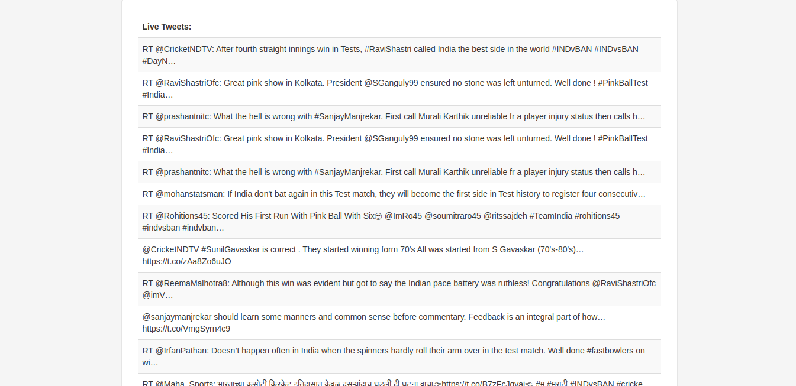

# Requirements
- Java - 1.8.x
- Gradle - 3.5+

# Rest APIS
##Search for a keyword
Aim to search tweet from a given keyword such as hashtag or plain text
```http
GET  /tweets/?source=%23IndVsBan
GET  /tweets/?source=elections
```
Request params:

| Parameter | Type | Description |
| :--- | :--- | :--- |
| `source` | `string` | **Required**. Your search keyword |

##Search for a specific twitter account
Aim to get tweets for a specific twitter account
```http
GET  /tweets/?source=@ayushjain2911
```
Request params:

| Parameter | Type | Description |
| :--- | :--- | :--- |
| `source` | `string` | **Required**. An specific twitter account |
## Response
API endpoints return the JSON response
```javascript
{
  "statusCode" : int,
  "data" : [{
        "userName" : string,
        "userDisplayName" : string,
        "text" : string
  }]
}
```
## Status Codes

Response returns the following status codes in its API:

| Status Code | Description |
| :--- | :--- |
| 200 | `SUCCESS` |
| 400 | `BAD REQUEST` |
| 404 | `NOT FOUND` |
| 500 | `INTERNAL SERVER ERROR` |

# Live Stream Dashboard
## Dashboard
```http
  URL/?source=%23IndVsBan
```
| Parameter | Type | Description |
| :--- | :--- | :--- |
| `source` | `string` | **Required**. Your search keyword |

## WebSockets in a Spring Boot Application

- `/app/live` - Message Mapping URL
- `/topic/source.{query}` - Message Broker topic for pushing messages to the UI back.

## UI


## WebSockets Payload
WebSockets pushes the JSON response contains new tweets
```javascript
[
    {
        "userName" : string,
        "userDisplayName" : string,
        "text" : string
    }
]
```
## WebSockets Events
  - annotate `@EventListener` to determine 'onSessionConnected' and 'onDisconnectEvent' and track sessions.
```java
@Configuration
@EnableWebSocketMessageBroker
public class WebSocketConfig {

    @EventListener
    public void onSessionConnected(SessionConnectEvent event) {
    }

    @EventListener
    public void onDisconnectEvent(SessionDisconnectEvent event) {
    }
}
```

### @EventListener Function
###### onSessionConnected
> Track sessionId from `StompHeaderAccessor` class.
> Store sessionId in the `SessionManager`.
###### onDisconnectEvent
> Remove sessionId in the `SessionManager`.
> Terminate thread for the sessionId.


## Unit Testing
- `ApplicationTest` @SpringBootTest annotation tells Spring Boot to go and look for a main configuration class (one with @SpringBootApplication for instance), and use that to start a Spring application context.
- `TweetsServiceImplTest`
###### checkIfTweetsAreOfSameUser
> Validate each tweet by a particular user.
###### checkIfTweetsAreFromDifferentUsers
> Validate non null response for data payload in `BaseResponse`

## SessionManager
HashMap where `SessionId` is key `MaxSinceId` as value. Ideally this service works as standalone entity in distributed system.
Each user query will have different `SessionId`.

### Todo
- Integrate Sliding window to make sure the `getRateLimitStatus()` doesn't overflow.
- Enhance thread logic in web socket live feed controller.
- Add controller test cases.

## Twitter Java Api Examples
- (http://twitter4j.org/en/code-examples.html "Twitter Java Api Examples")
